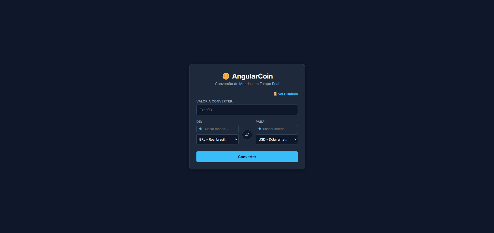
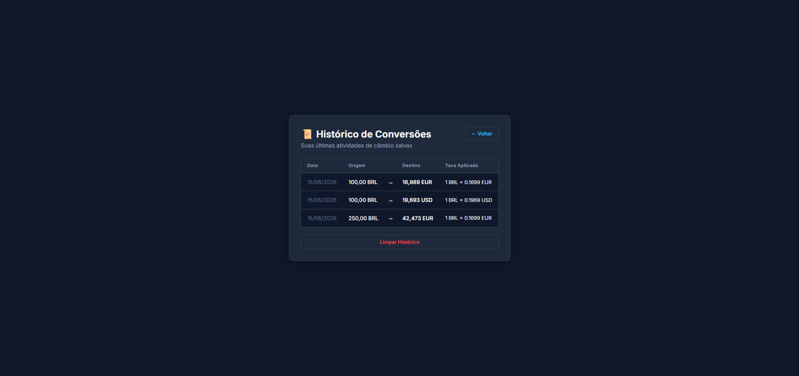
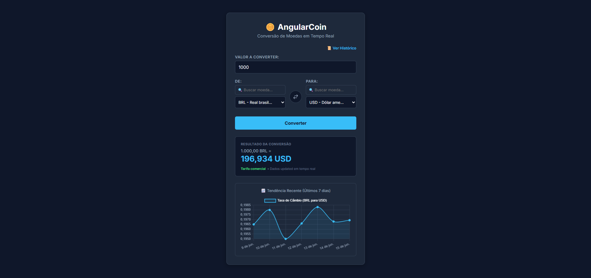

# AngularCoin 🪙

## 📝 Descrição do Projeto
O **AngularCoin** é um aplicativo web desenvolvido para a atividade final complementar. Trata-se de um app de conversão de moedas em tempo real que consome dados de APIs REST externas para permitir que os usuários consultem taxas de câmbio atualizadas e realizem conversões entre diferentes moedas globais de forma simples e intuitiva.

---

## 🚀 Funcionalidades
- **Conversão em Tempo Real:** Integração com API REST para taxas de câmbio atualizadas.
- **Histórico de Conversões:** Armazenamento local das consultas recentes (via Local Storage).
- **Modo Offline:** Consulta às últimas taxas armazenadas caso não haja conexão com a internet.
- **Interface Responsiva:** Design adaptável para dispositivos móveis e desktop.
- **Conversão Inversa:** Inversão rápida entre moeda de origem e destino com um clique.

---

## 🛠️ Tecnologias Utilizadas
- **Framework:** Angular
- **Linguagem:** TypeScript
- **API:** ExchangeRate-API / CurrencyConverterAPI
- **Estilização:** HTML5 / CSS3 (Interface Responsiva)

---

## 📸 Demonstração (Telas do Projeto)
*Substitua os links abaixo pelas imagens das telas quando o projeto estiver finalizado (Mínimo de 3 imagens exigidas).*

#### 1. Tela Principal (Conversor)


#### 2. Histórico de Conversões


#### 3. Modo Offline / Gráficos


---

## ⚙️ Como Executar o Projeto Localmente

1. Clone o repositório:
   ```bash
   git clone [https://github.com/SEU_USUARIO/AngularCoin.git](https://github.com/SEU_USUARIO/AngularCoin.git)
